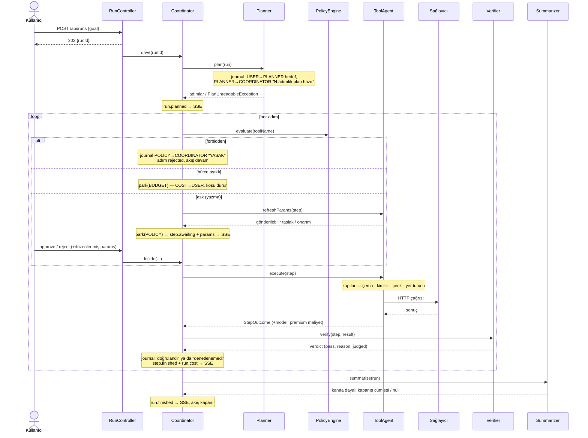
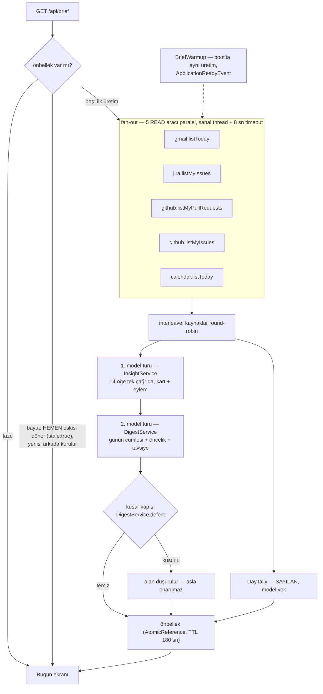
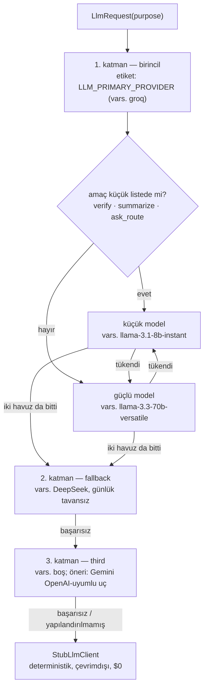
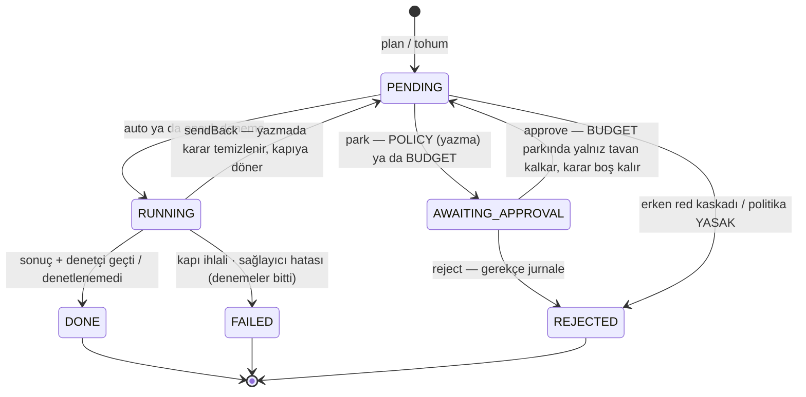
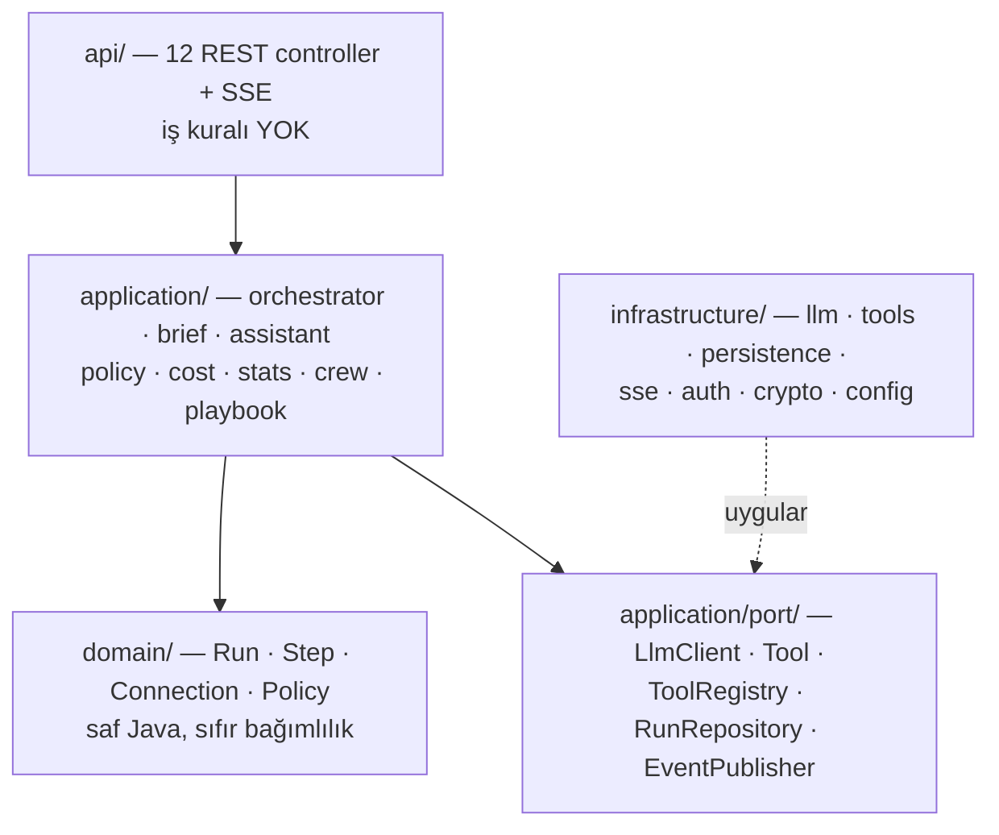

# Relay — Mimari

Bu doküman sistemin ana referansıdır: bir jürinin soracağı sırayla, koda inmeden
"nasıl çalışıyor"u anlatır. Her iddia `dosya:satır` taşır. Aksi belirtilmedikçe yollar
`backend/src/main/java/com/relay/` altına görelidir. Sahne cevapları için
[SORU-CEVAP.md](SORU-CEVAP.md), akış akış anlatım için [NASIL-CALISIYOR.md](NASIL-CALISIYOR.md).

---

## 1. Bir istek uçtan uca nasıl akıyor?

### 1.1 Bir koşu (run)

`POST /api/runs` hedefi doğrular (≤ 2000 karakter, `RunService.java:53`), kaydı açar ve
**hemen döner**; iş arka planda `Coordinator.drive` ile yürür (`RunService.java:56-70`).
İstemci `GET /api/runs/{id}/stream` ile SSE'ye bağlanır.

Adım döngüsünün kapı sırası bilinçli (`Coordinator.walk`, `Coordinator.java:179-328`):
iptal kontrolü → kullanıcı reddi → park edilmiş adım → **politika yasak** →
red kaskadı (`rejectedEarlier`, `Coordinator.java:608`) → **bütçe** → **onay kapısı** →
yürütme. Bütçe politikadan *önce* denetlenir (`Coordinator.java:235-239`): ters sıra,
kullanıcıya para mesajı okutup yazma izni imzalatıyordu.

Ajanlar arası her cümle hem `Run`'a yazılır hem `agent.message` olayı olarak akar —
tek yazar `AgentJournal.say` (`application/orchestrator/AgentJournal.java:25-30`).
SSE olay tipleri: `run.planned · step.started · step.awaiting · step.finished ·
agent.message · run.cost · run.finished` (`application/port/RunEvent.java:12-18`).
Planlayıcının atlandığı iki giriş (Bugün kartından `startFromSuggestion`,
`RunService.java:98`; playbook'tan `startFromPlaybook`, `RunService.java:235-254`)
aynı `walk` döngüsüne girer — kapının etrafından dolaşan hızlı yol yok.

### 1.2 Günün özeti (brief) hattı

Kaynaklar: fan-out `BriefService.java:224-236`, interleave `:491-505`, insight çağrısı
`:258` (`InsightService.java:119`, `MAX_ITEMS=14` `:54`), digest `:264`
(`DigestService.java:88-110`), sayılan gün `DayTally.java:95-138`.

- **Stale-while-revalidate.** Ölçüm (canlı): önbellek sıcakken 67 ms, soğuk üretim 3.6 s,
  yavaş sağlayıcıda 5.4 s, yedi Groq anahtarı da duvardayken ücretli katmana düşünce
  14.3 s. O saniyeler boyunca ekran, beklerken değişmeyen bir günün özetini bekliyordu.
  Artık TTL'i geçmiş özet anında verilir, yenisi arkada kurulur (`BriefService.brief`,
  `BriefService.java:134-148`; arka plan `revalidate()` `:158-171`). Yanıt `stale: true`
  ve `cachedAt` taşır — kimseye sessizce dün servis edilmez. **Yenile** yine bekler:
  o buton "bunun güncel olduğuna inanmıyorum" demektir (`:136`).
- **Tek uçuş.** Aynı anda gelen iki istek tek üretime katılır
  (`compareAndExchange`, `BriefService.java:182-200`).
- **Boot'ta ısıtma.** Deploy sonrası ilk brief canlıda 28.6 saniye ölçüldü; sonraki istek
  71 ms. Üretim ilk ziyaretçiden `ApplicationReadyEvent`'e alındı
  (`infrastructure/config/BriefWarmup.java:47-63`), aynı tek-uçuş kapısından geçer ve
  başarısızlığı asla açılışı düşürmez; `BRIEF_WARM_ON_START=false` kapatır (`:40-45`).
- **Kısmi başarı.** Her bölüm `ok | unavailable | error` + Türkçe gerekçe taşır; ham
  sağlayıcı hatası asla geçirilmez (`BriefService.failureReason`, `:349-377`).
  Bağlantısız fixture cevabı `unavailable` sayılır — demo verisi gerçek kutu gibi
  sunulmaz (`:335-341`).

---

## 2. "Master prompt" var mı?

**Yok, ve olmaması bilinçli.** Sekiz ayrı iş var; her birinin kendi sistem istemi, kendi
JSON şeması, kendi model katmanı ve kendi çıktı-token tavanı var. Tek dev istem olsaydı
üç şey kaybolurdu: iş başına maliyet ölçümü, ucuz işi ucuz modele verme imkânı ve
"bir işin kuralı öbürünü bozmasın" izolasyonu.

| Amaç (`LlmPurpose`) | İstemin yeri | Ne soruyor | Şema | Katman | Tavan |
|---|---|---|---|---|---|
| `PLAN` | `Planner.systemPrompt()` `Planner.java:199` (çağrı `:76`) | Hedef → sıralı adımlar, araç + parametre taslağı | var (`:235`) | güçlü | **3600** |
| `TOOL_PARAMS` | `ToolAgent.finaliseParams` `ToolAgent.java:720` (çağrı `:762`) | Aracın şemasına uyan kesin parametreler | aracın şeması | güçlü | 1400 |
| `VERIFY` | `Verifier.verify` `Verifier.java:64-71` (çağrı `:80`) | Sonuç adımın hedefini karşıladı mı | `{pass, reason}` (`:112`) | küçük | 1400 |
| `SUMMARIZE` | `Summarizer.java:50-64` (çağrı `:77`; araçsız adım için ikinci çağıran `ToolAgent.reason` `ToolAgent.java:135`) | Akış bitti, ne oldu — en fazla üç cümle | yok | küçük | 1400 |
| `INSIGHT` | `InsightService.java:261` (çağrı `:132`) | Bir mail/kayıt ne, ne kadar acil, ne yapılabilir | var | güçlü | **3600** |
| `DIGEST` | `DigestService.java:349` (çağrı `:103`) | Günün özeti, sıralama, tek öneri | var | güçlü | **3600** |
| `ASK_ROUTE` | `SourceRouter.java:614` (çağrı `:174`) | Soru → hangi okuma aracı, hangi sorgu | var | küçük | 1400 |
| `ASK_ANSWER` | `AskService.answerRequest` `AskService.java:577` (çağrı `:170`) | Bulunanlardan kaynaklı Türkçe yanıt | yok | güçlü | **3600** |

- **Katman ayrımı:** `LlmPurpose.DEFAULT_SMALL = {VERIFY, SUMMARIZE, ASK_ROUTE}`
  (`application/port/LlmPurpose.java:31`), `LLM_SMALL_PURPOSES` ile yapılandırılır
  (`application.yml:116`). Kural: yanlış olduğunda yanlış *yere yazan* işler güçlü modelde
  kalır; yanlış olduğunda yalnız bir cümle kötüleşenler küçüğe iner. Bilinmeyen amaç
  güçlü modele düşer — pahalı olabilir, yanlış olamaz (`LlmPurpose.java:19-30`).
- **Token tavanları:** `ROOM = 1400`, `LONG_ROOM = 3600`; 3600'ü alan küme
  `{PLAN, DIGEST, INSIGHT, ASK_ANSWER}` (`application/port/LlmRequest.java:24,48,51-52`).
  Neden: düşünen model çıktı bütçesini yazmadan önce akıl yürütmeye harcar. Ölçüm
  (2026-08-01, gemini-3.6-flash, digest istemi): `max_tokens=1400 → finish=length,
  düşünce 1095, yazı 301, kırpık`; `max_tokens=3600 → finish=stop, düşünce 784, yazı 379,
  geçerli JSON` (`LlmRequest.java:26-47`). Plan tarafında aynı duvar üç ardışık hedefte
  4 091 token harcayıp hiç ayrıştırılabilir plan üretmemişti. Bu bir tavan, harcama
  değil: yükseltmenin tek bedeli, doldurmaya karar veren bir model.
- **Modelin çıktısına asla olduğu gibi güvenilmez** — her istemin arkasındaki kapılar
  §4'te.

---

## 3. Model seçimini kim yapıyor?

Hiçbir iş kuralı model adı bilmez; `application` yalnız `LlmClient` portunu görür.
Seçimi iki katmanlı bir yönlendirici yapar.

- **Zincir bir listedir**, ikinci bir alan değil (`RoutingLlmClient.java:44,63-72`;
  kurulum `infrastructure/config/LlmConfig.java:188-194`). Üç sağlayıcı, çünkü
  2026-08-01'de iki sağlayıcı aynı saat içinde düştü: yedi Groq anahtarı günlük token
  duvarına çarptı, ücretli sağlayıcı HTTP 599 verdi (`application.yml:130-133`).
  Her katman aynı istemcidir — `{base}/chat/completions` + bearer anahtar — yani Groq,
  DeepSeek, Gemini, Cerebras, Together, OpenRouter hepsi ortam değişkeni, kod değil.
  Yapılandırılmamış katman hiç kurulmaz (`LlmConfig.java:143-145`).
- **Birincil etiket yapılandırılır:** `LLM_PRIMARY_PROVIDER` (`LlmConfig.java:91`,
  `application.yml:95`). Nedeni yaşandı: birincil Groq yerine başka sağlayıcıya
  çevrildiğinde her adım ekranda `groq:deepseek-v4-flash` yazacaktı — var olmayan bir
  sağlayıcı, bütün maliyet karşılaştırmasının yanına basılmış.
- **Küçük/güçlü ayrımı katman 1'in içindedir** (`GroqLlmClient.java:127-157`): amaç küçük
  listedeyse önce küçük model, değilse güçlü; biri tükenirse **iki yönde de** diğeri
  denenir. Havuzlar model başına ayrı (`GroqLlmClient.java:36-40`), çünkü Groq her modeli
  ayrı sınırlar — güçlü model tükenmişken aynı anahtar küçükte hâlâ cevap verebilir.
  Fallback ve third katmanları küçük katmansız kurulur (`LlmConfig.java:148-150`).

**Hata sınıfları** (`ApiKeyPool.java`, `GroqLlmClient.attempt` `:258-305`,
`HttpTransport.Reply` `HttpTransport.java:24-51`):

| Olay | Ne yapılır | Neden |
|---|---|---|
| `429` / kota | `penalize()`: anahtar sağlayıcının `Retry-After`'ı kadar park, **en çok 1 saat** (`ApiKeyPool.java:73,89-94`) | Eskiden 60 sn'ye kırpılıyordu: tükenmiş anahtar her dakika sıraya girip sağlamı da aynı 429'a sokuyordu (`:75-87`) |
| `401/403` | `retire()`: kalıcı (`ApiKeyPool.java:96-104`) | Beklemek iptal edilmiş anahtarı düzeltmez |
| `402` bakiye | park (1 saat), **emekli değil** (`GroqLlmClient.java:291-297`) | Bakiye öbür taraftan düzelir; emekli anahtar deploy'a kadar ölü kalırdı |
| `400` şema | rotasyon yok, doğrudan `LlmUnavailableException` (`GroqLlmClient.java:302`) | Başka anahtar bunu düzeltmez |
| `599` | taşıma katmanının sentezlediği kod (kesinti/IO, `JdkHttpTransport.java:44-46`); ≥500 gibi rotasyona girer | Ağ hatası anahtarın suçu değil ama o an cevap da değil |
| katman tükendi | `"all X keys exhausted"` deseni kalıcı arıza **saymaz** (`RoutingLlmClient.java:186-191`); sıradaki katmana geçilir, her katmanın hatası `lastError`'a **eklenir** (`:112-113`) | Yalnız ilk hata okunsa operatör yanlış sağlayıcıya para yatırırdı |
| hepsi bitti | stub cevaplar (`RoutingLlmClient.java:118`); `degraded=true`, sağlık `stub` der (`:206-208`) ve arayüz saklamaz | Şablon metin içgörü gibi sunulmaz: `Summarizer`/`DigestService` degraded'de hiç çalışmaz |

Groq kotası **kuruluş başına** sayılır, anahtar başına değil — aynı hesabın beş anahtarı
tek bütçeyi paylaşır (`ApiKeyPool.java:14-26`); `/api/health/details` reddeden
kuruluşları listeler (`GroqLlmClient.java:249-255`).

**Ölçülmüş ekonomi — READ pahalı, WRITE ucuz.** Bir READ aracı brief'e girer ve brief
kimse sormadan da her tazelemede döner: ölçümle **her tazeleme başına iki model turu**
(insight + digest). Bu ürün bir günde **627 bin token** harcayıp sağlayıcının günlük
duvarına çarptı ve harcayan okuma araçlarıydı. Bir WRITE aracı ise yalnız kullanıldığı
koşuda ~100 token tutar, kullanılmadığında sıfır. Bu yüzden `calendar.createEvent`,
`sheets.appendRow` ve `notion.createPage` bilinçli olarak brief'e **eklenmedi** — Notion
için okuma aracı hiç yok; sonradan eklemek bir tamamlama değil, karar olacak.
Aynı ayrım READ tarafında da işler: `sheets.readRange` bir READ ama **yalnız
planlayıcıya** açık, brief `SECTIONS`'ına girmedi. Pahalı olan okuma değil, brief'e giren
okumadır; plana giren bir READ yalnız kullanan koşuda şema payını (~60–130 token) öder.

---

## 4. Yanlış bir şey yazmasını ne engelliyor?

Kapı kataloğu. Her biri canlıda görülmüş bir olaydan doğdu; hiçbiri "kaliteyi
yargılamaz", hepsi deterministik desen/veri kontrolüdür. Ortak ilke: **kusurlu çıktı
düzeltilmez — düşürülür, durdurulur ya da insana geri götürülür.**

**1 · Şema kapısı — `SchemaValidator`** (`application/json/SchemaValidator.java`).
Araç şemasına uymayan parametre sağlayıcıya hiç gitmez; boş string "required" alanı
karşılamaz. `minItems` sonradan eklendi (`:96-98`): boş bir dizi "required"ı
tatmin eder — canlıda hücresiz bir Sheets satırı *hiçbir şey yazmayan bir yazma* olarak
başarıyla dönmüştü (`SheetsTool.java:115` bunu ilan eden tek şema).

**2 · Uydurulmuş kimlik — `ToolAgent.ungroundedIdentifier`** (`ToolAgent.java:271`).
"Bunu kapat" denince planlayıcı `issueKey: RELAY-1` uydurdu; Jira 404 verdi — şanslı
sonuç, o anahtar dolu bir tenant'ta yabancının kaydıydı. Yazma adımındaki
`*key/*id/*number` alanı hedefte, önceki adım sonuçlarında veya bağlantı ayarlarında
kelime sınırıyla geçmiyorsa (`mentions`, `:480` — `KAN-1`, `KAN-10`'un içinde saymaz)
adım durur. Koordinatör bunu ölüm değil onarım sayar: `insertLookupBefore`
(`Coordinator.java:516`) aynı sağlayıcının en ucuz arama adımını plana **görünür
şekilde** ekler, uydurulan anahtarı siler (`withoutIdentifiers`, `ToolAgent.java:168`)
ve yazma onaylıysa onayı da temizler.

**3 · Kap doğrulama — `ToolAgent.groundContainers`** (`ToolAgent.java:340`).
Bir akış sırayla `#genel`, `C046F7R6UE9`, `#general` kanallarına yazmayı denedi — üç
makul uydurma, üç `channel_not_found` — bağlantıda `defaultChannel=#all-samed` dururken.
Kayıt anahtarının aksine kabın güvenli cevabı var: doğrulanamayan `projectKey/channel/
repo/parentDatabaseId/spreadsheetId/sheetName` (`CONTAINER_FIELDS`, `:459`)
bağlantıdaki varsayılana çevrilir ve bu **onaydan önce** olur — onaylanan parametre
gönderilen parametredir.

**4 · Eksik zorunlu kap — `ToolAgent.withConfiguredContainers`** (`ToolAgent.java:407`).
Üçüncü kapı yalnız *yanlış* kabı düzeltiyordu; alan hiç yoksa kimse bakmıyordu. Canlıda
(2026-08-01) bağlantıda `projectKey=KAN` yazarken koşu `$.projectKey is required` ile
öldü — ve bir insana, bu hatayla ölecek taslak onaylatılmıştı. Artık şemanın **required**
saydığı boş kap bağlantıdan doldurulur; isteğe bağlı kap doldurulmaz (yokluğu "her yerde
ara" demektir) ve içerik alanları asla doldurulmaz — `summary` üretilemediyse bu bir
başarısızlıktır, hedef metni başlık diye ödünç alınmaz (`:389-405`).

**5 · Çözülmemiş yer tutucu — `ToolAgent.unresolvedPlaceholder`** (`ToolAgent.java:210`,
işaretler `application/text/Placeholder.java:20`). Slack'e kanal olarak
`{{steps[3].channel}}` gitti, cevap `channel_not_found` oldu — kafa karıştırıcı, çünkü
gönderilen şey hiç kanal adı değildi. Relay'de şablon motoru yok; `{{`, `}}`, `${`,
`steps[` içeren parametre modelin doldurmayı reddettiği alandır ve sağlayıcıya gitmez.
Açılı parantez bilinçli olarak listede yok — Slack'in kendi sözdizimi `<@U123>`.
Kapıda insanın yazdığı değer için de aynısı geçerli (`RunService.applyEdit`,
`RunService.java:373-377`).

**6 · Şablon/boş içerik — `Filler.looksLikeFiller` + `ToolAgent.emptyContent`**
(`application/text/Filler.java:39-50`, `ToolAgent.java:241`). Canlıda Slack'e şu
düştü: *"Relay özeti — … Adımlar Relay tarafından yürütüldü; ayrıntılar zaman
çizelgesinde."* Okuyan hiçbir şey öğrenmedi. İnsan okuyacak alanlar
(`text/message/body/comment/description`) bilinen kalıplara taranır; eşleşen mesaj
gönderilmez. Kapı kasıtlı aptal: kaliteyi yargılamaz, kalıp eşler.

**7 · Gönderilemez taslak kapıya gelmez — `Coordinator.rewriteBeforeAsking`**
(`Coordinator.java:270-283, 486`; `ToolAgent.unpresentable` `ToolAgent.java:580`). Canlı ölçüm
(2026-08-01 16:18, "Maili işe çevir" playbook'u): `projectKey`'siz ve `summary`'siz bir
`jira.createIssue` onaya sunuldu, isimle onaylandı, araç tam o eksik alanlar için
reddetti ve **aynı gönderilemez taslak aynı insana geri geldi** — onay kartında
`params={}`. Bu ürün insandan tek şey ister: gönderilecek olanı okuyup karar vermek;
gönderilemeyen taslak o dikkati hiçliğe harcar. Artık şemayı geçmeyen ya da okunmaz
(yer tutuculu/şablonlu) taslak kapıya çıkmadan onarım turuna girer; `Step.MAX_RETRIES`
(2) içinde düzelmezse adım **alan adlarını sayarak** başarısız olur.

**8 · Okunamayan plan koşuyu düşürür — `Planner.PlanUnreadableException`**
(`Planner.java:45-49`, atış `:79-83`). Canlıda, tüm Groq anahtarları duvardayken üç
hedeften ikisi ne posta kutusuna ne Jira'ya dokunan tek adımlık koşuya döndü ve ikisi de
**"Tamamlandı"** kapandı — plan `1) Hedefi özetle`, denetçi `doğrulandı` yazdı.
"Jira takılıyor" sanılan şey buydu: Jira hiç çağrılmıyordu. Ayrıştırılamayan yanıt
(düz yazı, düşünce zinciri) artık koşuyu Türkçe gerekçeyle `failed` kapatır; ayrışan ama
boş plan (`[]`) gerçek bir cevaptır ve tek düşünme adımına iner (`:85-93`). İkiz kural:
başarısızlık **harcadığını raporlar** — koşu try dışında tutulur ki 5 000 token yakan
plan `0 token · $0.000000` ile kapanmasın (`Coordinator.java:88-95`).

**9 · Denetçinin sessizliği onay değildir — `Verifier.Verdict.unjudged`**
(`Verifier.java:55-58`; ekrana çıkışı `Coordinator.java:416-421`). Canlı transkript:
`Adım 1 doğrulandı: verifier could not parse a verdict, accepting` — Türkçe "doğrulandı"
kelimesinin altında, tam tersini söyleyen İngilizce özür. Adım yine geçer (konuşamayan
denetçi işini bitirmiş koşuyu kilitlememeli), ama artık yargı `judged` bayrağı taşır ve
kimsenin denetleyemediği adım **"denetlenemedi … adım geçti, doğrulanmadı"** diye
yazılır. Komşu dal ters yöne düşer: `pass` alanı olmayan ama şikâyet taşıyan JSON adımı
**düşürür** (`Verifier.java:100-105`) — alanı eksik olumsuz yargıdır.

**10 · Bir onay bir deneme alır — `Coordinator.retryWithProviderFeedback`**
(`Coordinator.java:390-399, 436-448`). Canlı ölçüm: tek `jira.createIssue` onayı üç Jira
kaydı üretti — KAN-24, KAN-25, KAN-26, aynı yer tutucu özet, tek koşunun jurnalinde
1959/2212/1821 ms'de üç `tamam`. Kapı `decision != APPROVED` diye soruyor, `sendBack`
ise kararı temizlemiyordu: denetçinin reddettiği adım, başka bir deneme için verilmiş
"evet"i hatırlayan kapının önünden geçip sağlayıcıya döndü. Artık yazma adımı hangi
nedenle geri dönerse dönsün `decision=null` olur, parametreler o anda yeniden türetilir
ve adım kapıya gelir. Okuma adımları etkilenmez — harcanacak rıza yok.

**11 · Kapanış cümlesi kanıt ister — `Summarizer.invents` + `evidence`**
(`Summarizer.java:185, 145`). Canlı (15:12): dört parçalı hedefe tek `gmail.search`
adımı koştu; kapanış cümlesi GitHub #42, PR #43 ve takvim için "çalışıldı/tamamlandı"
yazdı — üç bitirme iddiası, üçü de hedef metninden okunmuş, denetim izinin son satırına
basılmış. İki açık kapatıldı: kanıt artık yalnız **koşan adımların sonuçları ve
başarısızlıkların hataları**dır — hedef ve adım başlıkları kanıt değildir ("istemek,
yapmış olmak değildir"); ve `#42` biçimli referanslar da tanınır (`#42`, `"number": 42`,
`/issues/42` sayılır; çıplak `42` sayılmaz — her sayıyı kanıt sayan kapı, kapı değildir).
Uyduran özet düzeltilmez, düşürülür; maliyet satırı koşuyu yine dürüstçe kapatır.

**12 · Digest kusur kapısı — `DigestService.defect`** (`DigestService.java:209-230`).
Canlıda sağlıklı modelden çıkan paragraf "…birlikte beberapaNeeds_reply mailleri
bekliyor. id=gmail:19fbb1…" ve "…önemli bir vấn" diye okunuyordu. Her alan gösterilmeden
önce deterministik taranır: iç kimlik (`id=`, `gmail:…`), istemin kendi alan adları
(`aciliyet=`), ham enum (`needs_reply` — bilerek baştaki `\b`'siz, sızıntı
`beberapaNeeds_reply` biçimindeydi), Türkçe alfabe dışı harf ya da bilinen Endonezce
kelime. Kusurlu alan düşürülür; `summary` düşerse digest hiç dönmez — sayılan üst satır
(`DayTally`) modelsiz üretildiği için ekran yine dolu kalır.

**13 · Ekip adı — `Planner.crewName`** (`Planner.java:117-123`). Model `"role":
"assistant"` yazmayı seviyor (OpenAI'nin sohbet terimi) ve bu, akış panosunda
`gmail.listToday`'in yanına basılıyordu. Araçlı adımın rolü artık modelden hiç okunmaz —
araç adından türetilir; araçsız adımda tanınmayan rol kadro listesine düşer.

**14 · Sır şekilleri — `HttpJson.SECRET_SHAPES`** (`infrastructure/tools/HttpJson.java:103-114`).
Jurnale/log'a çıkan her sağlayıcı hata gövdesi, yayıncı başına birer desenle
(Atlassian `ATATT…`, Slack `xox…`, Google `ya29.`/`1//…`, GitHub `gh?_`, Notion `ntn_`,
Groq `gsk_`, yankılanan `Authorization` başlığı) karartılır; `401/403` gövdesi **hiç**
alıntılanmaz — sağlayıcılar reddettikleri kimliği oraya yankılar (`:77-82`). Desen,
token o şekliyle veritabanında *var olabildiği anda* eklenir, ilk sızıntıda değil:
`ntn_` Notion aracından önce, sağlayıcıyla birlikte girdi.

Katalog dışında aynı ailedendir: erken reddin yazma kaskadı (`rejectedEarlier`,
`Coordinator.java:608` — reddedilen adımın sonucunu duyuracak yazma çalışmaz), hiçbir
şey koşmadan reddedilen koşunun `DONE` kapanamaması (`Coordinator.java:319-327`),
sınırsız JQL'in bağlanması (`JiraTool.bound`, `JiraTool.java:64`), bülten postasının
model ne derse desin düşürülmesi (`InsightService.demoteBulk`) ve API'de token maskesi
(`application/connection/Masking.java`).

---

## 5. Onay kapısı gerçekte neyi garanti ediyor?

Durumlar `domain/StepStatus.java:4-18`; geçiş metotları `domain/Step.java:113-198`;
`MAX_RETRIES = 2` (`Step.java:14`). Park nedeni ayrı bir tiptir ve **adımda saklanır**
(`PauseReason`, `domain/PauseReason.java:13-19`) çünkü onay ayrı bir HTTP isteğidir —
"şu an bütçe aşık mı" diye bakmak, tavanı sessizce kaldırıyordu
(`RunService.approveNow:330-336`).

Kapının değişmezleri:

1. **Kapı yalnız gönderilebilir parametre gösterir.** Park edilmeden önce parametreler
   kesinleştirilir (`refreshParams`, `Coordinator.java:246-248`); şemayı geçmeyen ya da
   okunmaz taslak kapıya çıkamaz (§4/7). İnsan taslağı değil, gönderilecek metni okur.
2. **Onaylanan parametre == gönderilen parametre.** Kap düzeltmeleri onaydan *önce*
   yapılır (§4/3-4); kapıda insanın düzelttiği alanlar `paramsLocked` ile kilitlenir —
   ne model ne varsayılan doldurma üzerine yazar (`Step.java:43`,
   `ToolAgent.java:725`); düzenleme şemadan geçmezse **400 + alan bazlı hata** ve adım
   onayda kalır (`RunService.applyEdit:354-383`).
3. **Bir onay bir deneme alır.** Adım kapı arkasına hangi yoldan dönerse dönsün
   (denetçi reddi, sağlayıcı hatası, plan onarımı) yazma adımının kararı temizlenir ve
   yeni parametrelerle yeniden sorulur (§4/10).
4. **Bütçe onayı yazma onayı değildir.** `BUDGET` parkını onaylamak yalnız tavanı
   kaldırır (`run.budgetOverridden`); adım kararsız kalır ve yazma ise kendi kapısına
   ayrıca gelir (`Step.resumeAfterBudget`, `Step.java:139-142`).
5. **Red kaybolmaz.** Gerekçe `decision=REJECTED` ile adıma yazılır, koordinatör adımı
   terminal yapar ve gerekçe sonraki adımların istemine giren geçmişin parçası olur
   (`RunService.rejectNow:402-427`, `Coordinator.rejectStep:638`); reddedilen adımın
   sonucunu duyuracak sonraki yazmalar da kaskadla düşer.
6. **Yıkıcıya insan şart.** `DESTRUCTIVE` varsayılanı `forbidden`; operatör `ask`e
   gevşetebilir ama `auto` yapamaz — API 400 döner, elle yazılmış `auto` satırı bile
   `ask`e çekilir (`PolicyEngine.set:120-129`, `capped:95-97`). Kayıtsız (halüsinasyon)
   araç adı otomatik `forbidden` (`PolicyEngine.evaluate:43-46`).

---

## 6. Katman haritası

Ok yönü bağımlılık yönüdür ve içe akar; grep ile doğrulanmıştır: `domain/` hiçbir
`com.relay.*` tipi import etmez, `application/` hiçbir `infrastructure.*` tipi görmez.
`api/` yalnız SSE/kimlik tesisatı için dört dosyada `infrastructure`'a uzanır. Pratik
karşılığı: sağlayıcı değiştirmek ortam değişkeni, araç eklemek tek `@Component`
(`ToolRegistryImpl` sınıf yolundaki her `Tool`'u toplar,
`infrastructure/tools/ToolRegistryImpl.java:17-25`).

Kayıtlı araçlar: **28 araç — 14 READ (auto), 14 WRITE (ask), 0 DESTRUCTIVE.**
`jira.*` 7 (4R+3W) · `gmail.*` 4 (3R+1W: yalnız taslak) · `github.*` 4 (2R+2W) ·
`calendar.*` 3 (2R+1W) · `notion.*` 3 (1R+2W) · `slack.*` 2 (1R+1W) · `sheets.*` 2 (1R+1W) ·
`confluence.*` 1 (1W, jira bağlantısına biner) ·
`docs.*` 1 (1W, google bağlantısına biner) · `hr.*` 1 (1W, google bağlantısına biner:
izin defteri bir Google tablosudur). Politika satırı araç başına türetilir —
`GET /api/policies` 28 satır döner (`PolicyEngine.effectivePolicies:100-112`).

### Nereye bakmalı

| Soru | Yer |
|---|---|
| Adım maliyeti nereye yazılır? | `CostMeter.record` → `Step.addCost` + `Run.addCost` (`application/cost/CostMeter.java:61-76`, `domain/Step.java:202-231`) |
| Onay kapısının kendisi? | `Coordinator.java:241` (koşul) · `park` `:573` · `RunService.approveNow:313-345` |
| Plan istemi? | `Planner.systemPrompt` `Planner.java:199-218` |
| Model zinciri nerede kurulur? | `infrastructure/config/LlmConfig.java:188-194` |
| Token tavanları? | `application/port/LlmRequest.java:24,48-52` |
| Küçük/güçlü ayrımı? | `application/port/LlmPurpose.java:31` + `application.yml:116` |
| Anahtar rotasyonu ve park süreleri? | `infrastructure/llm/ApiKeyPool.java:43-104` |
| Fiyat listeleri ve premium hesap? | `application.yml:98-104,126-127` · `GroqLlmClient.parse:364-376` |
| Yeni araç nasıl eklenir? | `application/port/Tool.java:11-43` arayüzü + `@Component` |
| Kapıdaki parametre düzenlemesi? | `RunService.applyEdit:354-383` · `application/orchestrator/ParamEdit.java:63-110` |
| Sırlar nasıl karartılır? | `infrastructure/tools/HttpJson.java:77-114` · `application/connection/Masking.java` |
| SSE olayları ve tekrar oynatma? | `application/port/RunEvent.java:12-18` · `infrastructure/sse/SseEventPublisher.java` |
| Brief önbelleği / SWR / ısıtma? | `BriefService.java:134-171` · `infrastructure/config/BriefWarmup.java:47-63` |
| Politika varsayılanları? | `domain/RiskLevel.java:13-19` · `PolicyEngine.evaluate:39-63` |
| Adım durum makinesi? | `domain/StepStatus.java:4-18` · `domain/Step.java:113-198` |
| İz kaydının tek yazarı? | `application/orchestrator/AgentJournal.java:25-30` |
| Fixture/replay modu? | `infrastructure/tools/ToolsMode.java:6-19` · `FixtureStore.java:22` |
| Kapanış özetinin kanıt kuralı? | `Summarizer.evidence` `Summarizer.java:145` |
| Hazır akışlar (playbook)? | `application/playbook/Playbooks.java:14-110` |
| Panel istatistikleri (premium karşılaştırma)? | `application/stats/PanelStatsRepository.java:169-178` · `infrastructure/persistence/JpaPanelStatsRepository.java:239-243` |

---

## 7. Veri modeli ve para kuralları

PostgreSQL + Flyway. Ana kümeler (`domain/` saf Java, JPA karşılıkları
`infrastructure/persistence/`):

| Küme | Alanlar |
|---|---|
| `Run` (`domain/Run.java:14-26`) | `id, goal, status(planning\|awaiting_approval\|running\|done\|failed\|cancelled), createdAt, finishedAt, costTokens, costUsd, budgetUsd(null=tavansız), budgetOverridden, steps[], messages[]` |
| `Step` (`domain/Step.java:14-91`) | `id, runId, ordinal(onarımda kayar), title, role, toolName, params(jsonb), status(pending\|running\|awaiting_approval\|done\|failed\|rejected\|skipped), decision(auto\|approved\|rejected), rejectReason, result(jsonb), error, lastProviderError, paramsLocked, pausedBy(policy\|budget), startedAt, finishedAt, tokens, costUsd, model, premiumCostUsd, attempts` — `skipped` (#168): ön koşulu boş çıkan adım; gerekçe `result` jsonb'sinde `{skipped:true, reason}` olarak durur, göç gerekmedi çünkü `status` kısıtsız `varchar(32)` |
| `AgentMessage` | `runId, stepId?, fromAgent, toAgent, content, createdAt` — zaman çizelgesinin kaynağı |
| `Connection` (`domain/Connection.java:12-17`) | `provider (jira\|github\|slack\|google\|notion)`, `config` — AES-GCM şifreli (`AesGcmCipher`, anahtar `APP_ENCRYPTION_KEY`); `toString` yalnız anahtar adlarını basar (`:59-63`) |
| `ToolPolicy` (`domain/ToolPolicy.java:4`) | `provider, toolName(PK), mode(auto\|ask\|forbidden)` — yalnız operatör override'ları; efektif liste kayıttan türetilir |
| `User` / `UserSession` | e-posta `Locale.ROOT` ile küçültülür; oturum token'ının yalnız SHA-256'sı durur |

Adım sayaçları: `Views.runSummary` `stepCount`, `doneStepCount` **ve** `skippedStepCount`
taşır (#168). Ekrandaki payda atlanan adımlar kadar küçülür ve atlama sözle söylenir
(`1/1 adım · 2 atlandı`) — `1/3` sonsuza dek "takıldı" gibi okunur, `3/3` ise hiç
yapılmamış işi yapılmış sayar.

**Para kuralları** — bu ürünün satış cümlesi "harcadığını sayar", o yüzden kurallar sert:

- **`null` = "dürüstçe türetilemez", asla sıfır değil.** Sıfır bir ölçümdür.
  `Step.premiumCostUsd` javadoc'u bunu sözleşme yapar (`domain/Step.java:78-90`);
  başarısız plan bile harcadığını raporlar (§4/8).
- **`premiumCostUsd` = aynı ölçülmüş token'lar, güçlü modelin fiyat listesiyle.**
  Tahmin değil aritmetik — jüri yeniden hesaplayabilir (`GroqLlmClient.parse:364-376`;
  cevaplayan modelin listesi `cost`u, güçlü liste `premium`u verir). Tek bilinmeyen
  token'lı çağrı tüm adımın premium'unu `null`'a kilitler (`Step.addCost`, `domain/Step.java:221-226` latch),
  `(0,0)`'lık bedava çağrı ise rakamı zehirlemez (`:212-220`). SQL toplamları
  `premium_cost_usd is not null` filtresiyle alınır ki fiyatlanamayan satır tasarruf
  iddiasını şişirmesin (`JpaPanelStatsRepository.java:239-243`).
- **Para süreçten tek biçimde çıkar:** 6 haneye `BigDecimal` (`CostMeter.usd:37-42` —
  telde `3.82E-4` görünmesin), tüketen tek yer `application/view/Views.java:44,50,89` ve
  kapanış jurnal satırı (`Coordinator.java:719-721`). Arayüzde rakamlar uçtan uca mono +
  tabular basılır ve birimin içinde sağa yaslanır — `4.246 token` ile `614 token`
  ardışık kartlarda aynı hizada biter (Akışlar kart grid'i, `frontend/src/components/RunCards.tsx`).
- **Bütçe:** toplam `budgetUsd`'yi aşarsa koordinatör sonraki adımda `BUDGET` parkı yapar
  (`CostMeter.budgetExceeded:84-86`, `Coordinator.java:235-239`); onay tavanı yalnız o
  koşu için kaldırır.

Çok kiracılılık **yok** ve bu bilinçli: `runs`/`connections`/`tool_policies`'te
`user_id` yoktur; `users` kimin klavyede olduğunu söyler, veriyi bölmez
(ayrıntı NASIL-CALISIYOR.md §7).

---

## 8. Yığın, arayüz ve işletme

| Katman | Teknoloji |
|---|---|
| Backend | Java 21 + Spring Boot 3.4, Gradle wrapper (JDK: `~/jdk21`) |
| Veritabanı | PostgreSQL + Flyway |
| Gerçek zamanlı | SSE (`/api/runs/{id}/stream`) — tek yönlü akış yeterli, `EventSource` çerezle kimliklenir |
| LLM | Üç katmanlı OpenAI-uyumlu zincir + deterministik stub (§3) |
| Frontend | React + Vite + TypeScript, grafikler dahil kütüphanesiz (~300 satır: pasta/huni/çubuk, `frontend/src/components/PanelCharts.tsx` + `frontend/src/lib/funnel.ts`) |
| Deploy | Docker + Coolify, n11'in paylaşımlı Caddy kenarı (runbook: `deploy/DEPLOY.md`, NASIL-CALISIYOR.md §9) |

Arayüzün bugünkü hâli, hepsi 1440×900'de ölçülerek: **Akışlar** sunucudaki 222 koşunun
tamamına sayfalanır ve her koşu tek grid'lik bir karttır (aynı gün giren ag-grid aynı gün
çıktı: 232.12 KB gzip'lik lazy chunk, kartlı listede bir diziyi dilimlemek için ödeniyordu;
ziyaret 389.65 → 157.65 KB). **Politikalar** ve **Ekip** sağlayıcı sekmelerine bölündü ve
ekrana sığdı (1206→863 px, 1473→886 px). **Panel**'in 13 bölümü — 5076 px, 5.6 ekran —
üç sekmeye indi (`#/panel?bakis=akis|onay|maliyet`) ve her veri kendi işaretini aldı:
durum dağılımı halka, onay hattı huni (aritmetiği `lib/funnel.ts`'te ayrı test edilir —
beş uç sayı `gated`i tutmazsa çubuk kısa kalır ve farkı yazar), yönlendirme tek ölçekte
iki çubuk. **Bugün**'de her öncelik kartı, komşularından *farkını* söyleyen bir olgu
şeridi taşır (`factStrip`, `frontend/src/lib/insight.ts:293`).

Performans hedefleri: hedeften ilk plana < 5 sn, SSE ilk olay < 1 sn, araç çağrısı
zaman aşımı 15 sn (`infrastructure/tools/HttpJson.java:15`), brief araç başına 8 sn
(`application.yml:66`).
