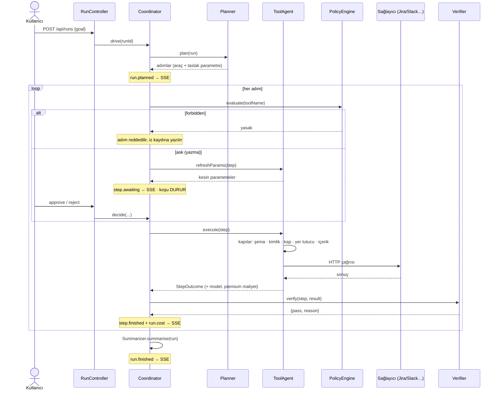
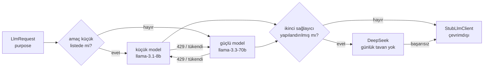
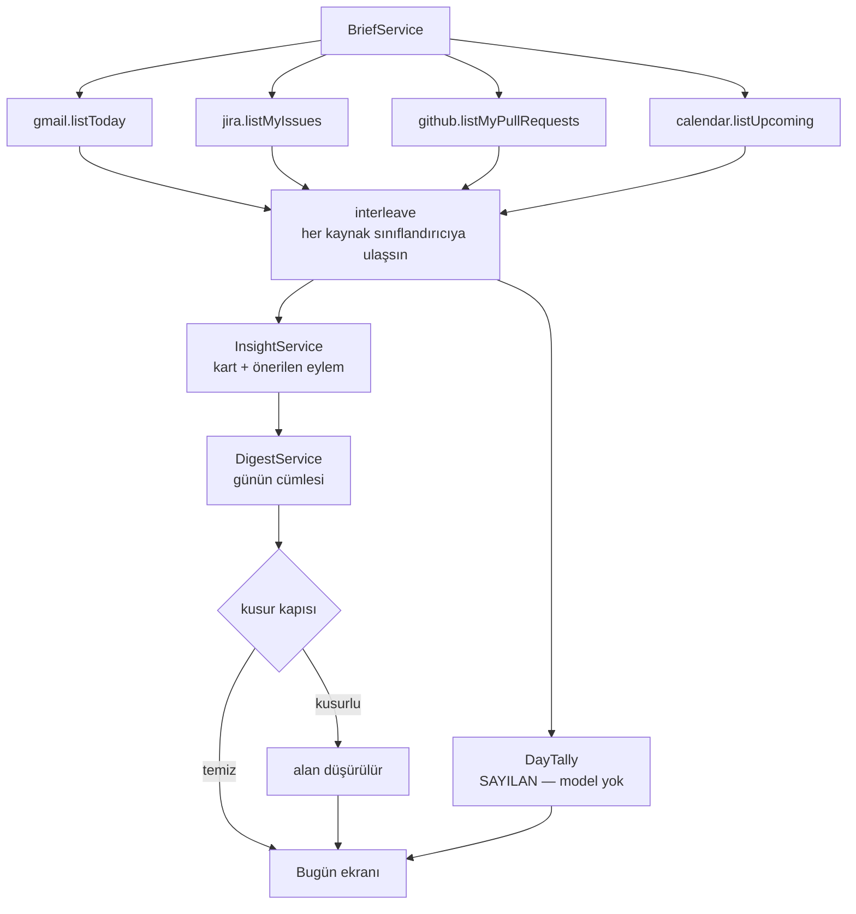
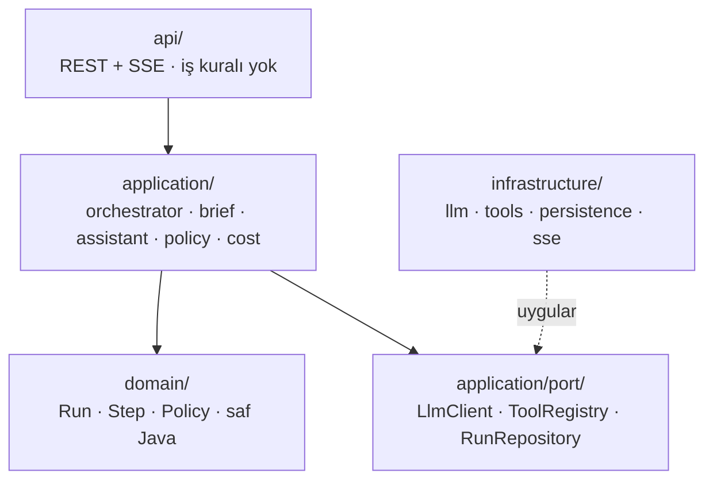

# Relay — Mimari

---

## 0. Nasıl çalışıyor — istem mimarisi

**Tek bir "master prompt" yok ve olmaması bilinçli.** Sekiz ayrı iş var, her birinin
kendi sistem istemi, kendi JSON şeması, kendi model katmanı ve kendi koruma kapıları
var. Tek bir dev istem olsaydı üç şeyi kaybederdik: hangi işin ne kadar tuttuğunu
ayrı ayrı ölçemezdik, ucuz işi ucuz modele veremezdik, ve bir iş için yazılmış kural
başka bir işi bozardı.

| Amaç (`LlmPurpose`) | Kod | Ne soruyor | Şema | Katman |
|---|---|---|---|---|
| `PLAN` | [`Planner.systemPrompt()`](../backend/src/main/java/com/relay/application/orchestrator/Planner.java) | Hedef → sıralı adımlar, her adımda araç + parametre taslağı | var | güçlü |
| `TOOL_PARAMS` | [`ToolAgent.finaliseParams()`](../backend/src/main/java/com/relay/application/orchestrator/ToolAgent.java) | Bu aracın şemasına uyan kesin parametreler | aracın şeması | güçlü |
| `VERIFY` | [`Verifier.verify()`](../backend/src/main/java/com/relay/application/orchestrator/Verifier.java) | Sonuç adımın hedefini karşıladı mı | `{pass, reason}` | küçük |
| `SUMMARIZE` | [`Summarizer.summarise()`](../backend/src/main/java/com/relay/application/orchestrator/Summarizer.java) | Akış bitti, ne oldu — en fazla üç cümle | yok | küçük |
| `INSIGHT` | [`InsightService`](../backend/src/main/java/com/relay/application/brief/InsightService.java) | Bir mail/kayıt ne, ne kadar acil, ne yapılabilir | var | güçlü |
| `DIGEST` | [`DigestService`](../backend/src/main/java/com/relay/application/brief/DigestService.java) | Günün özeti, sıralama ve tek öneri | var | güçlü |
| `ASK_ROUTE` | [`SourceRouter`](../backend/src/main/java/com/relay/application/assistant/SourceRouter.java) | Soru → hangi okuma aracı, hangi sorgu | var | küçük |
| `ASK_ANSWER` | [`AskService`](../backend/src/main/java/com/relay/application/assistant/AskService.java) | Bulunanlardan kaynaklı Türkçe yanıt | yok | güçlü |

Katman ayrımı [`LlmPurpose.DEFAULT_SMALL`](../backend/src/main/java/com/relay/application/port/LlmPurpose.java)
ve `LLM_SMALL_PURPOSES` ortam değişkeniyle yapılandırılır. Kural: **yanlış olduğunda
yanlış yere yazılan işler güçlü modelde kalır** (`PLAN`, `TOOL_PARAMS`), yanlış olduğunda
yalnız bir cümle kötüleşen işler küçük modele iner (`VERIFY`, `SUMMARIZE`, `ASK_ROUTE`).
Bilinmeyen bir amaç güçlü modele düşer — güvenli yön.

### Modelin çıktısına asla olduğu gibi güvenilmez

Her istemin arkasında kapılar var; hepsi canlıda görülmüş bir hatadan doğdu.

| Kapı | Kod | Neyi durdurur |
|---|---|---|
| Şema doğrulama | `SchemaValidator` | Araç şemasına uymayan parametre |
| Uydurulmuş kimlik | `ToolAgent.ungroundedIdentifier` | Hiçbir yerde geçmeyen `KAN-42` ile yazma |
| Kap doğrulama | `ToolAgent.groundContainers` | Uydurulmuş `projectKey`/`channel` → bağlantıdaki varsayılan |
| Yer tutucu | `ToolAgent.unresolvedPlaceholder` | `{{steps[3].channel}}` sağlayıcıya gitmez |
| Şablon metin | `Filler.looksLikeFiller` | "Adımlar yürütüldü" gibi içi boş mesaj |
| Uydurulmuş kayıt | `Summarizer.invents` | Koşunun hiç görmediği anahtarı anan özet |
| Özet kusuru | `DigestService.defect` | İç kimlik, başka dil, ham enum sızıntısı |
| Ekip adı | `Planner.crewName` | Modelin yazdığı `assistant` rolü |

Bunların hepsi **sessiz düşürme** ilkesiyle çalışır: kusurlu çıktı düzeltilmez, gösterilmez.
Sayılan veriler (`DayTally`) modelden bağımsız üretildiği için ekran yine de boş kalmaz.

---

## 0.1 Bir koşu, baştan sona



Kaynaklar: [`RunController`](../backend/src/main/java/com/relay/api/RunController.java) ·
[`Coordinator.walk()`](../backend/src/main/java/com/relay/application/orchestrator/Coordinator.java) ·
[`SseEventPublisher`](../backend/src/main/java/com/relay/infrastructure/sse/SseEventPublisher.java)

**Onay kapısının tek kuralı:** parametreler kapıya gelmeden *önce* kesinleştirilir. Aksi
hâlde insan planlayıcının boş taslağını onaylar. Onaydan sonra parametreler değişirse
karar temizlenir ve adım kapıya geri gelir — bkz. `retryWithProviderFeedback` ve
`insertLookupBefore`.

---

## 0.2 Model yönlendirme ve düşme sırası



Kaynaklar: [`RoutingLlmClient`](../backend/src/main/java/com/relay/infrastructure/llm/RoutingLlmClient.java) ·
[`GroqLlmClient`](../backend/src/main/java/com/relay/infrastructure/llm/GroqLlmClient.java) ·
[`ApiKeyPool`](../backend/src/main/java/com/relay/infrastructure/llm/ApiKeyPool.java)

Bilinmesi gereken üç şey:

1. **Groq kotası kuruluş başına sayılır, anahtar başına değil.** Aynı hesabın beş
   anahtarı tek bütçeyi paylaşır. `/api/health/details` reddeden kuruluşları listeler.
2. **Sağlayıcının istediği bekleme süresi uygulanır** (en fazla 1 saat). Eskiden 60
   saniyeye kırpılıyordu; bu, tükenmiş anahtarın her dakika sıraya girip sağlam olanı
   da aynı 429'a sokması demekti.
3. **402 emekliye ayırmaz, bekletir.** "Bakiye yok" öbür taraftan düzelen bir şey;
   emekliye ayrılan anahtar bir sonraki deploy'a kadar ölü kalırdı.

Her adım hangi modelin cevapladığını ve **aynı token'ların güçlü modelde ne tutacağını**
kaydeder (`steps.model`, `steps.premium_cost_usd`). Karşılaştırma aritmetiktir: aynı
ölçülmüş token, ikinci fiyat listesi. Fiyatlanamayan bir çağrı varsa değer `null` olur —
sıfır değil, çünkü sıfır bir iddiadır.

---

## 0.3 Günün özeti — model çalışmasa da ayakta



Kaynaklar: [`BriefService`](../backend/src/main/java/com/relay/application/brief/BriefService.java) ·
[`DayTally`](../backend/src/main/java/com/relay/application/brief/DayTally.java) ·
[`InsightService`](../backend/src/main/java/com/relay/application/brief/InsightService.java) ·
[`DigestService`](../backend/src/main/java/com/relay/application/brief/DigestService.java)

`DayTally` bu şemanın en önemli kutusu: **sayılan gün modelden bağımsız üretilir.** Kota
bittiğinde yorum cümleleri gelmez ama "bugün 5 iş var, 2 tanesi acil" satırı yerinde durur.
Sağlayıcılar paralel çağrılır ve biri düşerse yalnız o bölüm `unavailable` olur.

---

## 0.4 Katmanlar ve bağımlılık yönü



Ok yönü bağımlılık yönüdür ve **içe akar**. `infrastructure` hiçbir yerden çağrılmaz;
portları uygular ve Spring onu bağlar. Bunun pratik karşılığı: Groq'u DeepSeek'le
değiştirmek üç ortam değişkeni, Jira'ya yeni bir araç eklemek tek bir sınıf.

## 1. Stack

| Katman | Teknoloji |
|---|---|
| Backend | **Java 21 + Spring Boot 3.4**, Gradle wrapper |
| Veritabanı | PostgreSQL + Flyway |
| Gerçek zamanlı | **SSE** (`/api/runs/{id}/stream`) — WebSocket değil, tek yönlü akış yeterli |
| Frontend | React + Vite + TypeScript |
| LLM | Groq (çoklu anahtar + rotasyon), arayüz arkasında |
| Deploy | Docker + Coolify, n11 paylaşımlı Caddy edge'i |

JDK: `~/jdk21` (Temurin 21.0.11). `JAVA_HOME=~/jdk21` gerekiyor.

---

## 2. Katmanlar — bağımlılıklar içe akar

```
domain/          Run, Step, AgentMessage, ToolCall, Policy, Cost — saf Java, bağımlılık yok
application/     portlar + orkestrasyon
  port/          LlmClient, ToolRegistry, RunRepository, EventPublisher, Clock
  orchestrator/  Coordinator, Planner, Executor, Verifier
  policy/        PolicyEngine (auto | ask | forbidden)
  cost/          CostMeter
infrastructure/  portların uygulamaları
  llm/           GroqLlmClient (anahtar rotasyonlu), StubLlmClient
  tools/         JiraTool, SlackTool, ToolRegistryImpl
  persistence/   JPA repository'leri
  sse/           SseEventPublisher
api/             REST controller'ları + SSE. İş kuralı YOK.
```

**SOLID karşılıkları**

| İlke | Uygulanışı |
|---|---|
| **S** | `PolicyEngine` yalnızca politika, `CostMeter` yalnızca maliyet, `Planner` yalnızca plan |
| **O** | Yeni araç = `Tool` arayüzünü uygulayan yeni sınıf. Orkestratör değişmez |
| **L** | `StubLlmClient` ↔ `GroqLlmClient` aynı sözleşme — demo günü anahtar biterse stub'a düşülür |
| **I** | `Tool` dar: `name()`, `schema()`, `execute(params)` |
| **D** | `application` yalnızca `LlmClient`/`ToolRegistry`'yi bilir; Groq ve Jira `infrastructure`'da |

---

## 3. Ajan kadrosu ve çalışma döngüsü

```
Kullanıcı hedefi
   │
   ├─ PLANNER      hedef → adımlar (her adımda: rol, araç, parametre taslağı)
   │
   ├─ COORDINATOR  her adımı ilgili ARAÇ UZMANI'na devreder
   │                 └─ policy: auto → çalıştır | ask → beklet | forbidden → reddet
   │
   ├─ TOOL AGENT   yalnızca kendi aracını bilir, parametreleri kesinleştirir, çağırır
   │
   └─ VERIFIER     sonucu hedefe karşı denetler; tutmuyorsa adımı geri gönderir (en fazla 2 kez)
```

Her geçiş bir **olay** üretir ve SSE'den akar. Ajanlar arası mesajlar da olaydır — kim kime ne dedi görünür.

---

## 4. Veri modeli

```
Run          id, goal, status(planning|awaiting_approval|running|done|failed|cancelled),
             createdAt, finishedAt, costTokens, costUsd, budgetUsd

Step         id, runId, ordinal, title, role, toolName, params(jsonb), status,
             decision(auto|approved|rejected), rejectReason,
             result(jsonb), error, startedAt, finishedAt, tokens, costUsd,
             paramsLocked (parametreleri onay kapısında insan yazdı — uzman
             ajan da, adres düzeltmesi de üzerine yazmaz)

AgentMessage id, runId, stepId?, fromAgent, toAgent, content, createdAt

Connection   id, provider(jira|slack), config(jsonb, ŞİFRELİ), createdAt

ToolPolicy   provider, toolName, mode(auto|ask|forbidden)

User         id, email(unique, küçük harfe normalize), passwordHash(BCrypt, Google
             hesaplarında null), displayName, avatarUrl, provider(password|google),
             onboardedAt, createdAt

UserSession  id, userId, tokenHash(SHA-256), createdAt, expiresAt
```

Şifreleme: `Connection.config` AES-GCM ile şifrelenir, anahtar `APP_ENCRYPTION_KEY` ortam değişkeninden. Token'lar **asla** log'a yazılmaz, API yanıtlarında maskelenir (`xoxb-****1234`).

**Kapsam kararı — tek çalışma alanı.** Relay tek bir ortak çalışma alanıdır: giriş yapan herkes aynı bağlantıları, aynı koşuları ve aynı politikaları görür. `runs`/`connections` üzerinde bilinçli olarak `user_id` yoktur; `users` kimin klavyede olduğunu söyler, veriyi bölmez. Kullanıcı başına izolasyon isteniyorsa bu, şema değişikliği gerektiren ayrı bir iştir — "zaten vardır" varsayımıyla üzerine kod yazmayın.

Oturum: rastgele 32 baytlık opak token çereze (`relay_session`, HttpOnly · Secure · SameSite=Lax · 30 gün) yazılır, veritabanında yalnızca SHA-256'sı durur. İmzalı çerez yerine bunun seçilmesinin nedeni **iptal edilebilirlik**: çıkış yapınca satır silinir ve token o an ölür; imzalı çerez süresi dolana kadar geçerli kalırdı. Ayrıca çereze taşınması şart, çünkü `EventSource` özel başlık gönderemez — SSE ucu (`/api/runs/{id}/stream`) yalnızca çerezle çalışır.

---

## 5. API sözleşmesi

| Metot | Yol | Açıklama |
|---|---|---|
| `GET` | `/api/health` | `{status, version}` — kimliksiz, izleme için |
| `GET` | `/api/health/details` | `{status, version, llm, tools}` — oturum ister |
| `POST` | `/api/runs` | `{goal}` → `{runId}` — planlama başlar |
| `GET` | `/api/runs/{id}` | Run + adımlar + mesajlar (tam durum) |
| `GET` | `/api/runs/{id}/stream` | **SSE** — canlı olaylar |
| `POST` | `/api/runs/{id}/steps/{stepId}/approve` | Onay. İsteğe bağlı gövde `{params}` — kullanıcının ekranda düzelttiği alanlar; aracın şemasından geçmezse **400 + alan bazlı `fields`** ve adım onayda kalır. Bitmiş ya da iptal edilmiş koşuda **409** |
| `POST` | `/api/runs/{id}/steps/{stepId}/reject` | `{reason}` — gerekçe ajana gider |
| `POST` | `/api/runs/{id}/cancel` | Akışı durdur — başlamış araç çağrısı tamamlanır, kalan adımlar `rejected` olur, koşu `cancelled` kapanır. Bitmiş koşuda **409** |
| `POST` | `/api/runs/{id}/rerun` | Aynı hedefi tekrar çalıştır |
| `GET` | `/api/runs` | Geçmiş (sayfalı) |
| `GET`/`PUT` | `/api/connections` | Jira/Slack token'ları (maskeli döner) |
| `POST` | `/api/connections/{provider}/test` | Bağlantı testi |
| `GET`/`PUT` | `/api/policies` | Araç politikaları |
| `GET` | `/api/tools` | Kayıtlı araçlar + şemaları |
| `POST` | `/api/auth/register` | `{email, password, displayName?}` → oturum çerezi + `{user}` |
| `POST` | `/api/auth/login` | `{email, password}` → oturum çerezi + `{user}` |
| `POST` | `/api/auth/logout` | Çerezi ve oturum satırını siler |
| `GET` | `/api/auth/me` | `{authenticated, user, googleLogin}` — oturum yoksa da **200** |
| `POST` | `/api/auth/onboarding/complete` | Tanıtım turunu hesapta kalıcı olarak biter sayar |
| `GET` | `/api/auth/google/start` | Google'a yönlendirir — kapsam yalnız `openid email profile` |
| `GET` | `/api/auth/google/callback` | Kod → oturum çerezi, ardından SPA'ya döner |

**Koruma.** Bir servlet filtresi (`AuthFilter`) `/api/**` altındaki her şeyi çerezle korur; muaf olanlar tam olarak `/api/health`, `/api/auth/**` ve `/api/oauth/google/callback` — `/api/health/details` muaf **değil**. Oturumsuz istek **401 + JSON** alır, HTML yönlendirme değil — SPA'nın `fetch`'i bir giriş sayfasını okuyamaz.

**Google iki ayrı onaydır.** `/api/auth/google/*` yalnızca kimliktir (`openid email profile`, hiçbir token saklanmaz). Gmail/Takvim verisine erişim `/api/oauth/google/*` altındaki ayrı akıştır ve refresh token'ı şifreli `google` bağlantısında tutar. Giriş yapmak posta kutusunu vermek değildir; ikisi asla tek onaya indirgenmemeli.

### SSE olay tipleri

```
run.planned        { steps: Step[] }
step.started       { stepId }
step.awaiting      { stepId }                 // onay bekliyor
step.finished      { stepId, status, result, tokens, costUsd }
agent.message      { from, to, content, stepId? }
run.cost           { tokens, costUsd }        // her adımdan sonra
run.finished       { status }
```

### Tipler (frontend ↔ backend tek doğru kaynak)

```ts
type StepStatus = 'pending'|'awaiting_approval'|'running'|'done'|'failed'|'rejected'
type Step = {
  id: string; ordinal: number; title: string; role: string
  toolName: string | null; params: Record<string, unknown>
  status: StepStatus; decision: 'auto'|'approved'|'rejected'|null
  rejectReason: string | null
  result: unknown | null; error: string | null
  tokens: number; costUsd: number
  startedAt: string | null; finishedAt: string | null
}
type Run = {
  id: string; goal: string; status: string
  costTokens: number; costUsd: number; budgetUsd: number | null
  steps: Step[]; messages: AgentMessage[]
  createdAt: string; finishedAt: string | null
}
type AgentMessage = { id: string; stepId: string|null; fromAgent: string; toAgent: string; content: string; createdAt: string }
```

Tüm id'ler UUID string, alanlar `camelCase`.

---

## 6. Araç kayıt defteri — "3000+ entegrasyon"un gerçek uzantı noktası

```java
public interface Tool {
    String name();                    // "jira.updateIssue"
    String description();             // LLM'in araç seçimi için
    JsonNode schema();                // JSON Schema — parametreler
    RiskLevel risk();                 // READ | WRITE | DESTRUCTIVE
    ToolResult execute(JsonNode params, Connection connection);
}
```

Yeni araç eklemek: bu arayüzü uygulayan bir `@Component`. Spring onu otomatik toplar, `ToolRegistry` LLM'e sunar, `PolicyEngine` risk seviyesine göre varsayılan politikayı atar (`READ→auto`, `WRITE→ask`, `DESTRUCTIVE→forbidden`).

**MVP araçları**

| Araç | Risk |
|---|---|
| `jira.searchIssues` | READ |
| `jira.getIssue` | READ |
| `jira.updateIssue` | WRITE |
| `jira.addComment` | WRITE |
| `slack.listChannels` | READ |
| `slack.postMessage` | WRITE |

---

## 7. LLM katmanı — Groq + çoklu anahtar rotasyonu

```java
public interface LlmClient {
    LlmResponse complete(LlmRequest request);   // tokens + cost döner
}
```

`GroqLlmClient`:
- Anahtarlar `GROQ_API_KEYS` ortam değişkeninde **virgülle ayrılmış**
- Sırayla kullanılır; `429` veya kota hatası gelirse **sıradaki anahtara geçer** ve bozulan anahtar `cooldown`'a alınır (varsayılan 60 sn)
- Tüm anahtarlar tükenirse `StubLlmClient`'a düşülür ve arayüzde açık uyarı gösterilir
- Her yanıtta `promptTokens`, `completionTokens`, `costUsd` döner → `CostMeter`'a yazılır

`StubLlmClient`: deterministik, ağsız. Demo günü sigortası ve testlerin varsayılanı.

---

## 8. Performans ve deploy

| Metrik | Hedef |
|---|---|
| Hedeften ilk plana | < 5 sn |
| SSE ilk olay | < 1 sn |
| Araç çağrısı zaman aşımı | 15 sn |

Deploy Rung'dan aynen taşındı ve o kutuda kanıtlandı:
- Portlar **`127.0.0.1`'e DEĞİL** tüm arayüzlere yayımlanır — Caddy konteyner içinde ve `host.docker.internal` ile ulaşıyor
- Compose'da **`${VAR:?mesaj}` YASAK** — Coolify hata mesajını değer yapıyor
- Postgres healthcheck `-h db` ile kimlik doğrular (`127.0.0.1` `trust` kuralına düşer, yalancı sağlıklı verir)
- Coolify'da **FQDN alanı boş**, `SERVICE_FQDN_*` tanımlanmaz
- Caddy bloğu n11 reposunda `infra/digitalocean/Caddyfile` — droplet'te elle düzenlenmez
